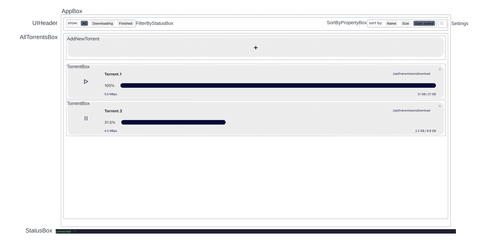

# Eurus Transmission UI

Eurus Transmission UI is a minimalistic web interface for a Transmission RPC server. Full interfaces exist with almost all possible configuration, the aim of this project is different: to create the simplest web interface possible. The functions of the app were minimized to those that an average user uses daily: adding, removing, stopping and continuing torrents. A minimal filtering is also present, should there be a lot of torrents to view.

The application is build with React and pure CSS stylesheet. The API calls the app makes are more or less compatible with the [Transmission RPC specification](https://github.com/transmission/transmission/blob/main/docs/rpc-spec.md). However, as Transmission's default server implementation misses some features that are usual with web servers (like support for CORS requests), and because the RPC convention is very thorough but not very simplistic, this web app was developed together with the [Eurus Transmission API wrapper](link) project. API convention here is following the RPC convention, but the Transmission implementation and the wrapper API are not one-on-one compatible. This project can still be a very good starting point to use directly with Transmission.

## Design considerations

When designing the app, the main motivator was simplicity. This appears in the layout, user interactions, colors. The app follow's the component based convention of React, the layout is somethig similar to:



The sub-components are not shown here, but feel free to review them in the source files. Header components are in the `src/header` folder, while torrent related components are in the `src/torrent` component. The status box and the warning box are in the root folder, just as the app box and the root component. While technically the root component is `App.js`, the nearest common ancestor to all components is `AppBox.js`, so all application logic is done there, the root component doesn't do much.

One interesting part of the application is that because of the wrapper API in between the app and the RPC server, the wrapper server itself, as well as the transmission server can be dead. This app handles the scenario when the wrapper API is not available, showing a disconnected status to the user. If the transmission server is offline, the API will give error messages in its response, which will be displayed as a warning. A periodic update function runs to update torrent data. If any API call fails (that is, the HTTP request fails), the update mechanism will be held, as it wouldn't make sense to do consecutive retries if the server is down. Instead, a periodic health check function will be configured, which queries the status of the API server. If the server is back, updates continue as usual. One way to simplify this double coupling is to serve the frontend app and the backend app from the same server - in this case if the app loads the assumption can be made that the backend runs fine. 

It's also possible to run this app for a different backend API server using CORS requests, the default `axios` instance needs to be configured in `AppBox.js`, preferably in `componentDidMount`:

```
axios.defaults.headers.common["access-control-allow-origin"] = this.state.serverAddress;
```

## Screenshots


## Deployment

For a quick test, run `npm start` and view the server at [http://localhost:3000](http://localhost:3000). The app will reload if you make changes to source files (and compilation is successful).

To build the app, run `npm run build`. This will build a production version to the `build` folder.

Because the app is very simple, no unit tests are provided. Should you need a few, feel free to contribute!

You have to configure your own wrapper API address in the constructor of the component `AppBox`, modifying the default value of the state variable `serverAddress`.

## Licensing and disclaimer

**Disclaimer:** This project was made for own use and is not extensively tested. Use at your own risk. Don't use this software for anything illegal, I'm not responsible for that!

This project runs under GNU General Public License v3.
